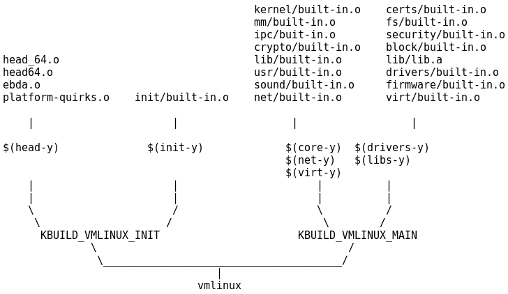

# 内核编译系统概述

linux kernel 的编译使用了一种叫作 kbuild 的系统来管理。Makefile 是一种非程序语言，我们可以把 kbuild 理解为一套用 makefile 语言写的编译 kernel 用的 utility。kbuild 系统包括几个component:

- the top Makefile: 位于源码根目录下的 makefile
- .config: kernel 位于源码根目录下的的配置文件
- arch/$(ARCH)/Makefile: 架构相关的 makefile
- scripts/Makefile.*: 所有与编译相关的通用规则, 处理变量的 routine 等等
- kbuild Makefiles: 位于各个子目录下的用于本目录编译的 makefile

kernel 的编译是 per directory/component-wise 的(逐目录，逐组件)。专业的说法是： recursive make。什么是 Recursive make?  在管理大型的 project 时，通常会将源码文件根据其作用(子系统)放在不同的目录，每一个子系统有它自己的 makeifle 来管理。通过顶层的 makefile 以适当的顺序调用每个子系统的 makefile。

the top Makefile 是编译 kernel 的入口，它会读取配置文件 .config 和 arch/$(ARCH)/Makefile。针对各种场景初始化一些编译所需要的公共变量，为真正的编译构建基础，然后 descend into 各个子文件夹进行编译。它负责两个主要产物的生成: vmlinux 和 modules，这二者的 rule 定义在 top Makefile 中。

Descend into 各子文件夹进行子系统编译是如何实现的？ 在 top Makefile 有如下:

	# Handle descending into subdirectories listed in $(vmlinux-dirs)
	# bluhbluh...

	PHONY += $(vmlinux-dirs)
	$(vmlinux-dirs): prepare scripts
		$(Q)$(MAKE) $(build)=$@

对，就是这句：

	$(Q)$(MAKE) $(build)=$@

实现了 descend into 子文件进行编译。将该句展开：

	make -f $(srctree)/scripts/Makefile.build obj=<subdir_name>

也就是进入了 scripts/Makefile.build 中进行后面的编译动作. 在 Makefile.build 中又依次 include 了:

>scripts/Kbuild.include
目标目录中的 kbuild makefile # 即 subdir_name 目录
scripts/Makefile.lib
scripts/Makefile.host # 如果kbuild makefile 中有定义 hostprogs-y

"目标目录中的 kbuild makefile" 的主要内容是 obj-y, obj-m 的定义, Makefile.lib 对这些定义进行了进一步的处理，比如: 筛出 composite object; 筛出更下一层的 subdir, 使用和上面一样的方式 descend 进去编译。

每一个目录中，编译的产物都被命名为 built-in.o，kbuild makefile 中的 obj-y 定义的是要被编译进 built-in.o 的所有 .o 的集合。下一层文件夹的 built-in.o 会被合并入上一层文件夹的 built-in.o 中，最后由所有根目录下的子文件夹的 built-in.o 文件生成根目录下的 vmlinux 文件。

借用一张图(以x86为例)来总结下这个关系：

但 vmlinux 文件并不是最终被直接使用的系统镜像文件，以 x86 为例，vmlinux 还要被处理(经过压缩等等)成为 bzImage 文件，这才是最终的系统启动镜像。

关于 module 的理解：
module 的本质意义是 function module，但它的呈现形式可以不同(定义在 obj-y 或者 obj-m)，可以是被编入内核而无形，也可以被编译 .ko 文件而有形。

kbuild 系统庞大而复杂，有无数细节，远不是一篇文字所能cover。但已有很多前人写过详细的分析(见末尾 Reference)，本文不再赘述。

当在源码目录下不加任何参数的执行 make 时，默认会编译 target: vmlinux, modules, bzImage ，也即 make help 输出中被 * 标记的那几个。

#### Reference:
1. Documentation/kbuild/makefiles.txt
2. [kbuild实现分析](http://blog.chinaunix.net/attachment/attach/20/77/84/4320778443a68d05ab8302e998e69d73307c89e124.pdf) 
3. [老司机带你探索内核编译系统--kbuild](http://blog.csdn.net/RichardYSteven/article/details/52930533)
4. [《深度探索Linux操作系统：系统构建和原理解析》第3章](http://book.51cto.com/art/201309/412050.htm)

