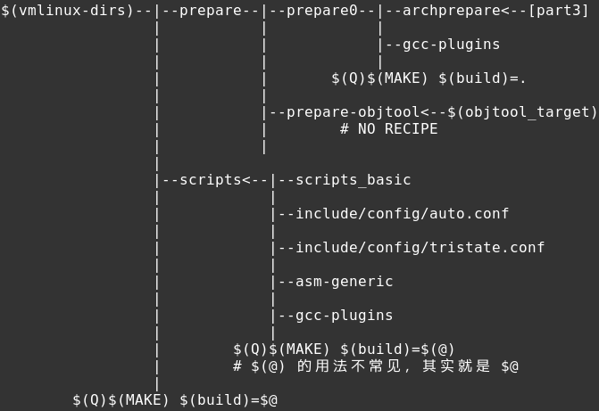
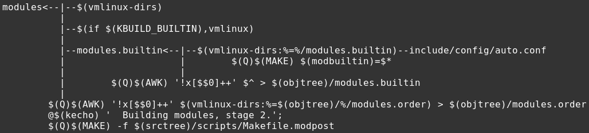

# What has `make [all]` done

配置结束后，作为想编译内核的小白，自然是直接敲入 make，或者 make all, 二者是一样的效果。
本文写作时的内核版本是 4.14 rc6，因为 kbuild 还在不断的变化，很有可能在细节上有变化。

Makefile 中的第一个 target 是 make 的 default goal。在 top Makefile 中，第一个 target 是：

	# That's our default target when none is given on the command line
	PHONY := _all
	_all:

_all 更的作用更像是个 placeholder，因为真正作用的 target 都是它的 prerequisites。当不加任何参数执行 make 时，这可能是整个编译过程最复杂的一步(这也意味着，本文可能无比的长)，用流程图来观察会更清晰；又因为流程无比的长，所以一张图是不够的，将分成几个 part。 

Part1：

直接 `make` 时的 target 有 3 个: vmlinux, bzImage, modules，一个个来介绍。

## vmlinux

可以看出 $(vmlinux-deps) 是重点，那它包含了什么？它的完整定义分散在 top Makefile 和 arch/x86/Makefile 中：

	vmlinux-deps := $(KBUILD_LDS) $(KBUILD_VMLINUX_INIT) $(KBUILD_VMLINUX_MAIN) $(KBUILD_VMLINUX_LIBS)
	# Externally visible symbols (used by link-vmlinux.sh)
	export KBUILD_VMLINUX_INIT := $(head-y) $(init-y)
	export KBUILD_VMLINUX_MAIN := $(core-y) $(libs-y2) $(drivers-y) $(net-y) $(virt-y)
	export KBUILD_VMLINUX_LIBS := $(libs-y1)
	export KBUILD_LDS          := arch/$(SRCARCH)/kernel/vmlinux.lds

	# head-y 定义来自于 arch/x86/Makefile
	head-y := arch/x86/kernel/head_$(BITS).o
	head-y += arch/x86/kernel/head$(BITS).o
	head-y += arch/x86/kernel/ebda.o
	head-y += arch/x86/kernel/platform-quirks.o

	# Objects we will link into vmlinux / subdirs we need to visit
	init-y          := init/
	drivers-y       := drivers/ sound/ firmware/
	net-y           := net/
	libs-y          := lib/
	core-y          := usr/
	virt-y          := virt/

	core-y          += kernel/ certs/ mm/ fs/ ipc/ security/ crypto/ block/

	# 下面 3 行定义也来自 arch/x86/Makefile
	libs-y  += arch/x86/lib/
	core-y += arch/x86/
	drivers-<CONFIG> # 一堆定义

	# 这一步处理把所有变量变成对应目录下的 built-in.o，除了 lib 目录下会有一个 lib.a
	init-y          := $(patsubst %/, %/built-in.o, $(init-y))
	core-y          := $(patsubst %/, %/built-in.o, $(core-y))
	drivers-y       := $(patsubst %/, %/built-in.o, $(drivers-y))
	net-y           := $(patsubst %/, %/built-in.o, $(net-y))
	libs-y1         := $(patsubst %/, %/lib.a, $(libs-y))
	libs-y2         := $(filter-out %.a, $(patsubst %/, %/built-in.o, $(libs-y)))
	virt-y          := $(patsubst %/, %/built-in.o, $(virt-y))

上面的代码指明了 $(vmlinux-deps) 的定义，即各个子目录下的 built-in.o 和若干 lib.a。
下面看看如何处理它(rule):

	# The actual objects are generated when descending,
	# make sure no implicit rule kicks in
	# 参考 GNU make 文档的 “4.10 Multiple Targets in a Rule”。所以，最终落到了 vmlinux-dirs 的处理上！
	$(sort $(vmlinux-deps)): $(vmlinux-dirs) ;

	# 将上面定义的各目录路径名后的 “/” 删除，得到 vmlinux-dirs
	vmlinux-dirs    := $(patsubst %/,%,$(filter %/, $(init-y) $(init-m) \
                     $(core-y) $(core-m) $(drivers-y) $(drivers-m) \
                     $(net-y) $(net-m) $(libs-y) $(libs-m) $(virt-y)))

	# Handle descending into subdirectories listed in $(vmlinux-dirs)
	# Preset locale variables to speed up the build process. Limit locale
	# tweaks to this spot to avoid wrong language settings when running
	# make menuconfig etc.
	# Error messages still appears in the original language
	$(vmlinux-dirs): prepare scripts
        	$(Q)$(MAKE) $(build)=$@

代码一堆，不如一张图来清晰的说明其依赖关系:
part2:

可以看出，在执行 vmlinux-dirs 的 recipe 之前有一堆的 prepare 工作要做，最重要的就是 archprepare，即 part3 的部分：

archprepare 下面一大块工作又是由 prepare1 来完成，即 part4:

巨长的流程，也可以铁杵磨成针。按照每一项任务的先后顺序(深度优先)来介绍。

### archheaders & archscripts

Target "archheaders" & "archscripts" 都定义在 arch/x86/Makefile 中，他们的定义都很清晰。archheaders 用于生成 arch/x86/include/generated/ 下的部分头文件；archscripts 用于生成 arch/x86/tools 下的 hostprogram: relocs。他们的 recipe 很简洁明了：

	$(Q)$(MAKE) $(build)=arch/x86/entry/syscalls all
	$(Q)$(MAKE) $(build)=arch/x86/tools relocs

archheaders 完成如下事情
创建2个文件夹：

>arch/x86/include/generated/asm
arch/x86/include/generated/uapi/asm

然后在 arch/x86/entry/syscalls 中，以 syscallhdr.sh & syscalltbl.sh 作为工具，分别处理 syscall_64.tbl & syscall_32.tbl， 生成：

>arch/x86/include/generated/uapi/asm/unistd_32.h
arch/x86/include/generated/uapi/asm/unistd_64.h
arch/x86/include/generated/uapi/asm/unistd_x32.h
&
arch/x86/include/generated/asm/syscalls_32.h
arch/x86/include/generated/asm/unistd_32_ia32.h (if defined CONFIG_X86_64)
arch/x86/include/generated/asm/unistd_64_x32.h (if defined CONFIG_X86_64)
arch/x86/include/generated/asm/syscalls_64.h (if defined CONFIG_X86_64)
arch/x86/include/generated/asm/xen-hypercalls.h (if defined CONFIG_XEN)

archscripts 完成的事情只是生成一个 host program: relocs

### include/config/auto.conf

flowchart 图中没有列出它后面的处理，实际后面有一些过程。它在 top Makefile 中 match 了下面这条 rule:

	# To avoid any implicit rule to kick in, define an empty command
	$(KCONFIG_CONFIG) include/config/auto.conf.cmd: ;

	# If .config is newer than include/config/auto.conf, someone tinkered
	# with it and forgot to run make oldconfig.
	# if auto.conf.cmd is missing then we are probably in a cleaned tree so
	# we execute the config step to be sure to catch updated Kconfig files
	include/config/%.conf: $(KCONFIG_CONFIG) include/config/auto.conf.cmd
		$(Q)$(MAKE) -f $(srctree)/Makefile silentoldconfig

在 clean src 配置完成后，auto.conf.cmd 是不存在的，是由上面的 recipe 生成。又一次 recursive make，调用自己完成 target silentoldconfig。由上一片文章可知，silentoldconfig 将 match 这条 rule:

	%config: scripts_basic outputmakefile FORCE
		$(Q)$(MAKE) $(build)=scripts/kconfig $@

所以，直接看 scripts/kconfig/Makefile 中的处理：

	silentoldconfig: $(obj)/conf
		$(Q)mkdir -p include/config include/generated
		$(Q)test -e include/generated/autoksyms.h || \
			touch   include/generated/autoksyms.h
		$< $(silent) --$@ $(Kconfig)

	hostprogs-y := conf nconf mconf kxgettext qconf gconf
	conf-objs       := conf.o  zconf.tab.o

部分细节过程可以直接参考上一篇文章。silentconfig 最终要执行的命令行是：

	scripts/kconfig/conf $(silent) --silentoldconfig Kconfig

同时创建了几个文件夹和文件：

>include/config
include/generated
include/generated/autoksyms.h

由可执行程序 conf 的 main 函数(conf.c)可以看到， 只有在 silentoldconfig 时， 才会调用函数 conf_write_autoconf，在此函数中会生成:

>include/config/auto.conf.cmd
include/generated/autoconf.h
include/config/tristate.conf
include/config/auto.conf

这里埋下一个小问题：从内容上看，auto.conf 和 tristate.conf 的内容有重复，有不同，他们是什么关系？

### include/config/kernel.release
Top Makefile 中：

	# Store (new) KERNELRELEASE string in include/config/kernel.release
	include/config/kernel.release: include/config/auto.conf FORCE
		$(call filechk,kernel.release)

	define filechk_kernel.release
		echo "$(KERNELVERSION)$$($(CONFIG_SHELL) $(srctree)/scripts/setlocalversion $(srctree))"
	endef

filechk 函数定义在 scripts/Kbuild.include 中：

	# filechk is used to check if the content of a generated file is updated.
	# Sample usage:
	# define filechk_sample
	#       echo $KERNELRELEASE
	# endef
	# version.h : Makefile
	#       $(call filechk,sample)
	# The rule defined shall write to stdout the content of the new file.
	# The existing file will be compared with the new one.
	# - If no file exist it is created
	# - If the content differ the new file is used
	# - If they are equal no change, and no timestamp update
	# - stdin is piped in from the first prerequisite ($<) so one has
	#   to specify a valid file as first prerequisite (often the kbuild file)
	define filechk
        	$(Q)set -e;                             \
        	$(kecho) '  CHK     $@';                \
       		mkdir -p $(dir $@);                     \
        	$(filechk_$(1)) < $< > $@.tmp;          \
        	if [ -r $@ ] && cmp -s $@ $@.tmp; then  \
                	rm -f $@.tmp;                   \
        	else                                    \
                	$(kecho) '  UPD     $@';        \
                	mv -f $@.tmp $@;                \
        	fi
	endef

生成 include/config/kernel.release。以我本地为例，其内容是: 4.14.0-rc6+，“+” 是脚本 scripts/setlocalversion 的结果。

### asm-generic 做什么

Target "asm-generic" 的处理近几个月发生了一些小小变化，有兴趣的同学请自行 git blame 细节。
以前，[long_recipe_0] 和 [long_recipe_1] 都是 asm-generic 的 recipe。先看两条 recipe 的定义：

[long_recipe_0]: $(Q)$(MAKE) -f $(srctree)/scripts/Makefile.asm-generic src=asm obj=arch/$(SRCARCH)/include/generated/asm
[long_recipe_1]: $(Q)$(MAKE) -f $(srctree)/scripts/Makefile.asm-generic src=uapi/asm obj=arch/$(SRCARCH)/include/generated/uapi/asm

每个 arch 有自己的专用的头文件, 位于 arch/$(SRCARCH)/include 目录, 此目录下还有 asm, uapi, generated 3个目录.
其中 generated 目录下的内容是编译过程中创建的，部分内容在 target "archheaders" 的处理流程中完成；“asm-generic” 负责生成其他的内容。

在 include/asm-generic 目录下存放的是一些 common 的头文件, 如注释所说:

>include/asm-generic contains a lot of files that are used verbatim by several architectures.

asm-generic 的做的事情是在 arch/$(SRCARCH)/include/generated 目录下创建一些 wrapper 文件, wrap include/asm-generic 下的一些文件，具体文件由 arch/x86/include/asm/Kbuild & arch/x86/include/uapi/asm/Kbuild 中定义的 generic-y 指定。
上述两个 Kbuild 文件中的 generated-y 指的是 archheaders 过程中生成的那些头文件。

对于这些变量的详细介绍，参考 “7 Kbuild syntax for exported headers” of Documentation/kbuild/makefiles.txt

### What is $(version_h)

变量 *version_h* 的定义和处理在 top Makefile 中：

	version_h := include/generated/uapi/linux/version.h
	old_version_h := include/linux/version.h

	define filechk_version.h
	        (echo \#define LINUX_VERSION_CODE $(shell                         \
	        expr $(VERSION) \* 65536 + 0$(PATCHLEVEL) \* 256 + 0$(SUBLEVEL)); \
	        echo '#define KERNEL_VERSION(a,b,c) (((a) << 16) + ((b) << 8) + (c))';)
	endef

只是简单的生成 include/generated/uapi/linux/version.h

### include/generated/utsrelease.h

生成此头文件，具体处理在 top makefile 中：

	include/generated/utsrelease.h: include/config/kernel.release FORCE
        	$(call filechk,utsrelease.h)

	# KERNELRELEASE can change from a few different places, meaning version.h
	# needs to be updated, so this check is forced on all builds
	uts_len := 64
	define filechk_utsrelease.h
        	if [ `echo -n "$(KERNELRELEASE)" | wc -c ` -gt $(uts_len) ]; then \
        	  echo '"$(KERNELRELEASE)" exceeds $(uts_len) characters' >&2;    \
        	  exit 1;                                                         \
        	fi;                                                               \
        	(echo \#define UTS_RELEASE \"$(KERNELRELEASE)\";)
	endef

这里有个 trick：rule 写的清楚，utsrelease.h 依赖于 kernel.release，但是，why？ 从 filechk_utsrelease.h 可以看出，正常情况下就是执行一句：

	echo \#define UTS_RELEASE \"$(KERNELRELEASE)\"

并且，KERNELRELEASE 在 top makefile 中的定义(很上面)如下：

	# Read KERNELRELEASE from include/config/kernel.release (if it exists)
	KERNELRELEASE = $(shell cat include/config/kernel.release 2> /dev/null)

但是第一次编译 kernel 前，kernel.release 文件明显是不存在的，所以 KERNELRELEASE 的值为空？可以知道它的值并不为空。这里的赋值操作符是 “=”，不是“：=”，这就是 trick 所在。参考 "6.2 The Two Flavors of Variables" of GNU 文档。

### gcc-plugins

Top Makefile 中 include 了 scripts/Makefile.gcc-plugins，target "gcc-plugins" 其中 。
关于 kbuild 对 gcc-plugins 的支持，参考： Documentation/gcc-plugins.txt。

gcc-plugin 以 .so 的形式存在，作为 gcc 的参数来使用：

	-fplugin=/path/to/name.so -fplugin-arg-name-key1[=value1] 

关于 gcc-plugin 本身的一切信息，在：[GCC 官方文档](https://gcc.gnu.org/onlinedocs/gccint/Plugins.html) 。

既然 gcc-plugin 以 .so 的形式存在 scripts/gcc-plugins 目录，那么在 kbuild 系统中它就是一个 host lib，所有编译相关的细节处理在 scripts/Makefile.host 中。

不同版本的 gcc 可能是被不同的编译器编译(gcc or g++)出来的，那么对应的plugin也要使用那个编译器。比如 gcc 4.8 以上都要使用 g++。

Target "gcc-plugins" 的作用是编译出 scripts/gcc-plugins 目录下的所有 plugin。

### $(vmlinux-dirs)

至此，$(vmlinux-dirs) 下的主要过程已介绍完，剩下的工作就是要编译 vmlinux 了，即执行：

	$(Q)$(MAKE) $(build)=$@

根据上文的分析，已知变量 vmlinux-dirs 的值是各个文件夹(with trailing "/" stripped)，具体的处理框架同 “make menuconfig” 文中的描述一致，编译进入 scripts/Makefile.build，其中依次 include:

>-include include/config/auto.conf # 配置已完成，auto.conf是存在的
include scripts/Kbuild.include
include $(kbuild-file) # kbuild makefile, 本例是 init/Makefile
include scripts/Makefile.lib # 对 kbuild makefile 中定义的通用变量(如 obj-y, obj-m 等) 进行处理

下面的代码分析来自上述这些 makeifle。

因为没有指定 target，所以 scripts/Makefile.build 中的第一条 rule(__build:)，即 default goal:

	__build: $(if $(KBUILD_BUILTIN),$(builtin-target) $(lib-target) $(extra-y)) \
	        $(if $(KBUILD_MODULES),$(obj-m) $(modorder-target)) \
	        $(subdir-ym) $(always)
	        @:

	ifneq ($(strip $(obj-y) $(obj-m) $(obj-) $(subdir-m) $(lib-target)),)
	builtin-target := $(obj)/built-in.o
	endif

	$(builtin-target): $(obj-y) FORCE
		$(call if_changed,link_o_target)

	ifneq ($(strip $(lib-y) $(lib-m) $(lib-)),)
	lib-target := $(obj)/lib.a
	obj-y += $(obj)/lib-ksyms.o
	endif

	modorder-target := $(obj)/modules.order

"__build" 作为 default goal， 在我们的假设场景下，它的 prerequisites 就是所有列出的，但我们下面只详细介绍关键部分。

obj-y，obj-m，extra-y，always 的定义基本都在 kbuild makefile 中(在 “3 The kbuild files” of Documentation/kbuild/makefiles.txt 有介绍 obj-y，obj-m，**必须**先阅读掌握)，subdir-ym 的定义在 scripts/Makefile.lib 中。

kbuild 中定义的 obj-y，obj-m 变量中有三种可能：

1. single object(由一个 .c 编译而来的 .o)
2. composite object(由多个 .c 编译而来的 .o)
3. sub-directory

kbuild 系统对这些变量的处理主要在 scripts/Makefile.lib 中：

	# Handle objects in subdirs
	# ---------------------------------------------------------------------------
	# o if we encounter foo/ in $(obj-y), replace it by foo/built-in.o
	#   and add the directory to the list of dirs to descend into: $(subdir-y)
	# o if we encounter foo/ in $(obj-m), remove it from $(obj-m)
	#   and add the directory to the list of dirs to descend into: $(subdir-m)
	# 经过下面代码的处理，定义在 obj-y 和 obj-m 中的文件夹被撸出到 subdir-ym；
	# obj-y 中的文件夹被替换为 foo/built-in.o，也就是说，当前目录的 built-in.o 中包含了所有子目录中的 built-in.o；
	# obj-m 中的文件夹被剔除。上面的注释也描述的很清楚。
	__subdir-y      := $(patsubst %/,%,$(filter %/, $(obj-y)))
	subdir-y        += $(__subdir-y)
	__subdir-m      := $(patsubst %/,%,$(filter %/, $(obj-m)))
	subdir-m        += $(__subdir-m)
	obj-y           := $(patsubst %/, %/built-in.o, $(obj-y))
	obj-m           := $(filter-out %/, $(obj-m))
	# 经过上面的处理，obj-y 目前内容是 single object，composite object，sub-dir/built-in.o;
	# obj-m 目前的内容是 single object， composite object；
	# subdir-y 的内容是 obj-y 中的目录； subdir-m 的内容是 obj-m 中的文件夹

	# Subdirectories we need to descend into
	subdir-ym       := $(sort $(subdir-y) $(subdir-m))

	# if $(foo-objs), $(foo-y), or $(foo-m) exists, foo.o is a composite object
	# 在 kbuild 中有时你会发现，赋值给 obj-y 的 foo.o，并不存在它对应的 foo.c，而可能存在 foo-objs，foo-y，foo-m 的定义，
	# 这样的 foo.o 被称作 composite object，即一个 foo.o 由多个 .o 合并而来。
	# 这样做的意义可能是为了逻辑清晰，因为有时某个功能可能由一个 .c 文件实现，有时则由多个 .c。
	# 下面的前三行代码将 obj-y 和 obj-m 中 composite object 的 .o 撸出到 multi-used。
	# 因为 obj-m 中现在只可能有  single object 和 composite object，第四行将 single object 挑出来。
	multi-used-y := $(sort $(foreach m,$(obj-y), $(if $(strip $($(m:.o=-objs)) $($(m:.o=-y))), $(m))))
	multi-used-m := $(sort $(foreach m,$(obj-m), $(if $(strip $($(m:.o=-objs)) $($(m:.o=-y)) $($(m:.o=-m))), $(m))))
	multi-used   := $(multi-used-y) $(multi-used-m)
	single-used-m := $(sort $(filter-out $(multi-used-m),$(obj-m)))

	# Build list of the parts of our composite objects, our composite
	# objects depend on those (obviously)
	# 从 composite object 分别撸出所有 .o 的列表。
	multi-objs-y := $(foreach m, $(multi-used-y), $($(m:.o=-objs)) $($(m:.o=-y)))
	multi-objs-m := $(foreach m, $(multi-used-m), $($(m:.o=-objs)) $($(m:.o=-y)))
	multi-objs   := $(multi-objs-y) $(multi-objs-m)

	# $(subdir-obj-y) is the list of objects in $(obj-y) which uses dir/ to tell kbuild to descend
	# subdir-obj-y 的值是所有的 foo/built-in.o
	subdir-obj-y := $(filter %/built-in.o, $(obj-y))

	# Replace multi-part objects by their individual parts, look at local dir only
	# 下面两个变量表示当前目录中所有需要编译得到的.o(composite object 和 single object)
	real-objs-y := $(foreach m, $(filter-out $(subdir-obj-y), $(obj-y)), $(if $(strip $($(m:.o=-objs)) $($(m:.o=-y))),$($(m:.o=-objs)) $($(m:.o=-y)),$(m))) $(extra-y)
	real-objs-m := $(foreach m, $(obj-m), $(if $(strip $($(m:.o=-objs)) $($(m:.o=-y)) $($(m:.o=-m))),$($(m:.o=-objs)) $($(m:.o=-y)) $($(m:.o=-m)),$(m)))

	# 下面还有一段代码给上述所有变量加上 $(obj) 前缀，此处不赘述。

现在回头看"__build"的 prerequisites的处理，即：$(builtin-target)， $(lib-target)， $(extra-y)，$(obj-m)， $(modorder-target)，$(subdir-ym) $(always)。

#### $(builtin-target)：

	# 经过 Makefile.lib 的处理，obj-y 中只可能有 single object, composite object，foo/built-in.o
	builtin-target := $(obj)/built-in.o
	$(builtin-target): $(obj-y) FORCE
		$(call if_changed,link_o_target)

	# If the list of objects to link is empty, just create an empty built-in.o
	cmd_link_o_target = $(if $(strip $(obj-y)),\
	                      $(cmd_make_builtin) $@ $(filter $(obj-y), $^) \
	                      $(cmd_secanalysis),\
	                      $(cmd_make_empty_builtin) $@)

	# 1. single object 的处理最简单，直接 match 下面这条 rule。所有 .c --> .o 的处理都 match 这条(比如 composite object 包含的所有 .o)
	# Built-in and composite module parts
	$(obj)/%.o: $(src)/%.c $(recordmcount_source) $(objtool_dep) FORCE
        $(call cmd,force_checksrc)
        $(call if_changed_rule,cc_o_c)

	define rule_cc_o_c
	        $(call echo-cmd,checksrc) $(cmd_checksrc)                         \
	        $(call cmd_and_fixdep,cc_o_c)                                     \
	        $(cmd_modversions_c)                                              \
	        $(call echo-cmd,objtool) $(cmd_objtool)                           \
	        $(call echo-cmd,record_mcount) $(cmd_record_mcount)
	endef

	cmd_cc_o_c = $(CC) $(c_flags) -c -o $@ $<

	# 下面几行代码定义在 scripts/Kbuild.include
	# Usage: $(call if_changed_rule,foo)
	# Will check if $(cmd_foo) or any of the prerequisites changed,
	# and if so will execute $(rule_foo).
	if_changed_rule = $(if $(strip $(any-prereq) $(arg-check) ),                 \
	        @set -e;                                                             \
	        $(rule_$(1)), @:)

	#上面的代码可以看出，$(call cmd_and_fixdep,cc_o_c 是核心，完成编译.c 的动作。

	# 2. obj-y 和 obj-m 中的 composite object 则 match 下面2条 rule。函数 multi_depend 的用法在"make menuconfig"的文章已介绍过。
	$(multi-used-y): FORCE
        	$(call if_changed,link_multi-y)
	$(call multi_depend, $(multi-used-y), .o, -objs -y)

	$(multi-used-m): FORCE
        	$(call if_changed,link_multi-m)
        	@{ echo $(@:.o=.ko); echo $(link_multi_deps); \
        	   $(cmd_undef_syms); } > $(MODVERDIR)/$(@F:.o=.mod)
	$(call multi_depend, $(multi-used-m), .o, -objs -y -m)
	
	# 一般情况下，上面2条 rule 的 recipe 的核心(link_multi-y, link_multi-m)最后都落在这一条(此处省略了一点分析)
	cmd_link_multi-link = $(LD) $(ld_flags) -r -o $@ $(link_multi_deps) $(cmd_secanalysis)
	
	# 3. foo/built-in.o match 下面这条
	# To build objects in subdirs, we need to descend into the directories
	$(sort $(subdir-obj-y)): $(subdir-ym) ;

	$(subdir-ym):
	        $(Q)$(MAKE) $(build)=$@
	# 怎么样，现在看起来是不是有点感觉了，又一次 recursive 的 make 了。
	# 就这样， $(obj)/built-in.o 依赖的所有 prerequisites 都准备好了，剩下的就是执行它的 recipe 了

总结：每一层文件夹下的所有 obj-y 生成 built-in.o，下一层的 built-in.o 会被 linked into 上一层的 built-in.o，最后 link 为 kernel src 目录下的 vmlinux 文件。

#### obj-m

经过 Makefile.lib 的处理，obj-m 中只剩下 single object 和 composite object，single object 的处理因有少许不同，所以并没有走普通 .o 的 rule，他们有自己的 rule 来处理：

	$(multi-used-m): FORCE
        	$(call if_changed,link_multi-m)
        	@{ echo $(@:.o=.ko); echo $(link_multi_deps); \
        	   $(cmd_undef_syms); } > $(MODVERDIR)/$(@F:.o=.mod)
	$(call multi_depend, $(multi-used-m), .o, -objs -y -m)

	$(single-used-m): $(obj)/%.o: $(src)/%.c $(recordmcount_source) $(objtool_dep) FORCE
	        $(call cmd,force_checksrc)
	        $(call if_changed_rule,cc_o_c)
	        @{ echo $(@:.o=.ko); echo $@; \
	           $(cmd_undef_syms); } > $(MODVERDIR)/$(@F:.o=.mod)
	#上面的 rule 的核心内容上和他们的同类是一样的。

	# MODVERDIR 定义在 top Makefile 中
	export MODVERDIR := $(if $(KBUILD_EXTMOD),$(firstword $(KBUILD_EXTMOD))/).tmp_versions

不同的是，会 echo 一些信息到 tmp_versions/ 目录下的同名文件中。
obj-m 中的每一个 single object 和 composite object 都是一个 module。 

#### $(modorder-target)

	modorder-target := $(obj)/modules.order

	$(modorder-target): $(subdir-ym) FORCE
		$(Q)(cat /dev/null; $(modorder-cmds)) > $@

	# Create commands to either record .ko file or cat modules.order from a subdirectory
	modorder-cmds =                                         \
	        $(foreach m, $(modorder),                       \
	                $(if $(filter %/modules.order, $m),     \
	                        cat $m;, echo kernel/$m;))

	# 下面的代码定义在 scripts/Makefile.lib
	# Determine modorder.
	# Unfortunately, we don't have information about ordering between -y
	# and -m subdirs.  Just put -y's first.
	modorder := $(patsubst %/,%/modules.order, $(filter %/, $(obj-y)) $(obj-m:.o=.ko))
	# 这里有一个疑问：为什么子目录的处理不包含 obj-m？难道 obj-y 和 obj-m 的子目录一定相同？
	# 答：因为 $(filter %/, $(obj-m)) 是 $(obj-m:.o=.ko) 的子集
 
从目录树的最底层开始，生成该目录下的 modules.order 文件。文件的内容包含下一层目录中同名文件的内容，和本层目录中的 $(obj-m:.o=.ko)。最底层的目录肯定是没有子目录的，所以只是 echo kernel/$m 到 modules.order 文件。

## bzImage

Target "bzImage" 定义在 arch(x86) Makefile 中:

	# In arch/x86/Makefile
	boot := arch/x86/boot

	# KBUILD_IMAGE specify target image being built
	KBUILD_IMAGE := $(boot)/bzImage

	bzImage: vmlinux
	ifeq ($(CONFIG_X86_DECODER_SELFTEST),y)
        	$(Q)$(MAKE) $(build)=arch/x86/tools posttest
	endif
        	$(Q)$(MAKE) $(build)=$(boot) $(KBUILD_IMAGE)
        	$(Q)mkdir -p $(objtree)/arch/$(UTS_MACHINE)/boot
        	$(Q)ln -fsn ../../x86/boot/bzImage $(objtree)/arch/$(UTS_MACHINE)/boot/$@

如果一路看本文至此，应该可以看出哪儿一句是最重要的步骤，下面是它的 flowchart:

bzImage 依赖于：setup.bin/setup.elf， vmlinux.bin，还有一个隐藏的 zoffset.h。前两个在下面两个小节里介绍，此处假设他们已经生成，所以剩下的工作就是执行 bzImage 的 recipe:

	cmd_image = $(obj)/tools/build $(obj)/setup.bin $(obj)/vmlinux.bin \
	                               $(obj)/zoffset.h $@ $($(quiet)redirect_image)

但发现，zoffset.h 好像不存在？ Let's 在 arch/x86/boot/Makefile 中找找看：

	setup-y         += early_serial_console.o edd.o *header.o* main.o memory.o

	$(obj)/header.o: $(obj)/zoffset.h
	
	$(obj)/zoffset.h: $(obj)/compressed/vmlinux FORCE
	        $(call if_changed,zoffset)

	sed-zoffset := -e 's/^\([0-9a-fA-F]*\) [ABCDGRSTVW] \(startup_32\|startup_64\|efi32_stub_entry\|efi64_stub_entry\|efi_pe_entry\|input_data\|_end\|_ehead\|_text\|z_.*\)$$/\#define ZO_\2 0x\1/p'

	cmd_zoffset = $(NM) $< | sed -n $(sed-zoffset) > $@
 
索戴斯乃，原来在 setup.elf 的处理过程中就需要用到 zoffset.h 了，所以在处理 bzImage 的时候，zoffset.h 已经存在了。但是它竟然依赖 compressed 目录下的 vmlinux，所以看起来其实 compressed/vmlinux 比 setup.bin 更早生成，不信我们来看看 make 的输出

>CC      arch/x86/boot/a20.o
  AS      arch/x86/boot/bioscall.o
  CC      arch/x86/boot/cmdline.o
  AS      arch/x86/boot/copy.o
  HOSTCC  arch/x86/boot/mkcpustr
  CPUSTR  arch/x86/boot/cpustr.h
  CC      arch/x86/boot/cpu.o
  CC      arch/x86/boot/cpuflags.o
  CC      arch/x86/boot/cpucheck.o
  CC      arch/x86/boot/early_serial_console.o
  CC      arch/x86/boot/edd.o
  LDS     arch/x86/boot/compressed/vmlinux.lds
  AS      arch/x86/boot/compressed/head_64.o
  VOFFSET arch/x86/boot/compressed/../voffset.h
  CC      arch/x86/boot/compressed/misc.o
  CC      arch/x86/boot/compressed/string.o
  CC      arch/x86/boot/compressed/cmdline.o
  CC      arch/x86/boot/compressed/error.o
  OBJCOPY arch/x86/boot/compressed/vmlinux.bin
  RELOCS  arch/x86/boot/compressed/vmlinux.relocs
  GZIP    arch/x86/boot/compressed/vmlinux.bin.gz
  HOSTCC  arch/x86/boot/compressed/mkpiggy
  MKPIGGY arch/x86/boot/compressed/piggy.S
  AS      arch/x86/boot/compressed/piggy.o
  CC      arch/x86/boot/compressed/cpuflags.o
  CC      arch/x86/boot/compressed/early_serial_console.o
  CC      arch/x86/boot/compressed/kaslr.o
  CC      arch/x86/boot/compressed/pagetable.o
  CC      arch/x86/boot/compressed/eboot.o
  AS      arch/x86/boot/compressed/efi_stub_64.o
  AS      arch/x86/boot/compressed/efi_thunk_64.o
  DATAREL arch/x86/boot/compressed/vmlinux
  LD      arch/x86/boot/compressed/vmlinux
  ZOFFSET arch/x86/boot/zoffset.h
  AS      arch/x86/boot/header.o
  CC      arch/x86/boot/main.o
  CC      arch/x86/boot/memory.o
  CC      arch/x86/boot/pm.o
  AS      arch/x86/boot/pmjump.o
  CC      arch/x86/boot/printf.o
  CC      arch/x86/boot/regs.o
  CC      arch/x86/boot/string.o
  CC      arch/x86/boot/tty.o
  CC      arch/x86/boot/video.o
  CC      arch/x86/boot/video-mode.o
  CC      arch/x86/boot/version.o
  CC      arch/x86/boot/video-vga.o
  CC      arch/x86/boot/video-vesa.o
  CC      arch/x86/boot/video-bios.o
  LD      arch/x86/boot/setup.elf
  OBJCOPY arch/x86/boot/setup.bin
  OBJCOPY arch/x86/boot/vmlinux.bin
  HOSTCC  arch/x86/boot/tools/build
  BUILD   arch/x86/boot/bzImage

可以看出，compressed/vmlinux 的确比 setup.bin 先生成，而且处理的顺序严格的遵循 make 依赖关系链中的深度优先原则。
如果是使用 `make -jN`，上面的输出会有小幅度的乱序，但是 compressed/vmlinux 仍然比 setup.bin 先处理。这是我的环境中的例子：

>CC      arch/x86/boot/a20.o
  AS      arch/x86/boot/bioscall.o
  CC      arch/x86/boot/cmdline.o
  AS      arch/x86/boot/copy.o
  HOSTCC  arch/x86/boot/mkcpustr
  CC      arch/x86/boot/cpuflags.o
  CC      arch/x86/boot/cpucheck.o
  CC      arch/x86/boot/early_serial_console.o
  CC      arch/x86/boot/edd.o
  CC      arch/x86/boot/main.o
  CC      arch/x86/boot/memory.o
  CC      arch/x86/boot/pm.o
  AS      arch/x86/boot/pmjump.o
  CC      arch/x86/boot/printf.o
  CC      arch/x86/boot/regs.o
  CC      arch/x86/boot/string.o
  CC      arch/x86/boot/tty.o
  CC      arch/x86/boot/video.o
  CC      arch/x86/boot/video-mode.o
  CC      arch/x86/boot/version.o
  CC      arch/x86/boot/video-vga.o
  CC      arch/x86/boot/video-vesa.o
  CC      arch/x86/boot/video-bios.o
  HOSTCC  arch/x86/boot/tools/build
  CPUSTR  arch/x86/boot/cpustr.h
  CC      arch/x86/boot/cpu.o
  LDS     arch/x86/boot/compressed/vmlinux.lds
  AS      arch/x86/boot/compressed/head_64.o
  VOFFSET arch/x86/boot/compressed/../voffset.h
  CC      arch/x86/boot/compressed/string.o
  CC      arch/x86/boot/compressed/cmdline.o
  CC      arch/x86/boot/compressed/error.o
  OBJCOPY arch/x86/boot/compressed/vmlinux.bin
  RELOCS  arch/x86/boot/compressed/vmlinux.relocs
  HOSTCC  arch/x86/boot/compressed/mkpiggy
  CC      arch/x86/boot/compressed/cpuflags.o
  CC      arch/x86/boot/compressed/early_serial_console.o
  CC      arch/x86/boot/compressed/kaslr.o
  CC      arch/x86/boot/compressed/pagetable.o
  CC      arch/x86/boot/compressed/eboot.o
  AS      arch/x86/boot/compressed/efi_stub_64.o
  AS      arch/x86/boot/compressed/efi_thunk_64.o
  CC      arch/x86/boot/compressed/misc.o
  GZIP    arch/x86/boot/compressed/vmlinux.bin.gz
  MKPIGGY arch/x86/boot/compressed/piggy.S
  AS      arch/x86/boot/compressed/piggy.o
  DATAREL arch/x86/boot/compressed/vmlinux
  LD      arch/x86/boot/compressed/vmlinux
  ZOFFSET arch/x86/boot/zoffset.h
  OBJCOPY arch/x86/boot/vmlinux.bin
  AS      arch/x86/boot/header.o
  LD      arch/x86/boot/setup.elf
  OBJCOPY arch/x86/boot/setup.bin
  BUILD   arch/x86/boot/bzImage

Ok，终于，终于可以回头看看 bzImage 的处理了:

	cmd_image = $(obj)/tools/build $(obj)/setup.bin $(obj)/vmlinux.bin \
	                               $(obj)/zoffset.h $@ $($(quiet)redirect_image)

形式上很简单，arch/x86/boot/tools/build 工具在 zoffset.h 的辅助下把 setup.bin 和 vmlinux.bin 写入到 bzImage 文件，写入的细节唯有看 arch/x86/boot/tools/build.c 代码。

### setup.bin/setup.elf

这二者本质上是同一个东西。setup.elf 的 rule 很简单：

	$(obj)/setup.elf: $(src)/setup.ld $(SETUP_OBJS) FORCE
		$(call if_changed,ld)
		
将 $(SETUP_OBJS) via linker script $(src)/setup.ld 链接为 setup.elf。$(SETUP_OBJS) 是 arch/x86/boot 下的一堆 .o(由.c 或 .S 编译得到)，使用 kbuild 通用 rule(makefile.build中) 来处理。
setup.bin 是使用 objdump 处理 setup.elf 而来，很简单的一条命令：

	objcopy -O binary setup.elf setup.bin

>objcopy can be used to generate a raw binary file by using an output target of binary (e.g., use -O binary).  When objcopy generates a raw binary file, it will essentially produce a memory dump of the contents of the input object file.  All symbols and relocation information will be discarded.  The memory dump will start at the load address of the lowest section copied into the output file.
       
### vmlinux.bin

由依赖关系可知，arch/x86/boot/vmlinux.bin 的生成主要依赖 arch/x86/boot/compressed/vmlinux（注意和 root source 目录下的 vmlinux区分），本小节中将简称为 vmlinux。其 rule 在 arch/x86/boot/compressed/vmlinux/Makefile 中的定义也很简单：

	$(obj)/vmlinux: $(vmlinux-objs-y) FORCE
	        $(call if_changed,check_data_rel)
	        $(call if_changed,ld)

作为 prerequisites 的 $(vmlinux-objs-y) 由一堆 .c 或 .S 编译来的 .o，加上 linker script 组成。其中的 piggy.o 是与其他的 $(vmlinux-objs-y) 的处理不同，也是最 tricky 的地方，因为并没有 piggy.c 或 piggy.S/piggy.s 的存在。

但因为 Makefile 中有 piggy.S 的 rule 存在

	$(obj)/piggy.S: $(obj)/vmlinux.bin.$(suffix-y) $(obj)/mkpiggy FORCE
	        $(call if_changed,mkpiggy)

所以，piggy.o 将 match Makefile.build 中的相应的 rule：

	$(obj)/%.o: $(src)/%.S $(objtool_dep) FORCE
		$(call if_changed_rule,as_o_S)
 
 So，原来 piggy.S 是生成的。因为内核的压缩默认使用 gzip，所以 suffix-y = gz。来看完整过程：
 
 	cmd_mkpiggy = $(obj)/mkpiggy $< > $@ || ( rm -f $@ ; false )
 	$(obj)/piggy.S: $(obj)/vmlinux.bin.$(suffix-y) $(obj)/mkpiggy FORCE
	        $(call if_changed,mkpiggy)

 	$(obj)/vmlinux.bin.gz: $(vmlinux.bin.all-y) FORCE
        	$(call if_changed,gzip)

	vmlinux.bin.all-y := $(obj)/vmlinux.bin
	vmlinux.bin.all-$(CONFIG_X86_NEED_RELOCS) += $(obj)/vmlinux.relocs

	$(obj)/vmlinux.bin: vmlinux FORCE
	        $(call if_changed,objcopy)

	#作者注：cmd_relocs 有 2 条命令，第二条似乎并没有输出内容到 target，为什么存在？
	cmd_relocs = $(CMD_RELOCS) $< > $@;$(CMD_RELOCS) --abs-relocs $<
	$(obj)/vmlinux.relocs: vmlinux FORCE
	        $(call if_changed,relocs)

vmlinux.bin 和 vmlinux.relocs 均由 root source 目录下的 vmlinux 处理而来，然后将二者 gzip 压缩，最后交由 host program: mkpiggy 来处理。

mkpiggy 的源程序真的很简单(arch/x86/boot/compressed/mkpiggy.c)，由它来生成 piggy.S 文件。同样，piggy.S 的内容也很简单，在我的环境中，它的内容长这样：

	.section ".rodata..compressed","a",@progbits
	.globl z_input_len
	z_input_len = 7195099
	.globl z_output_len
	z_output_len = 24546884
	.globl input_data, input_data_end
	input_data:
	.incbin "arch/x86/boot/compressed/vmlinux.bin.gz"
	input_data_end:

细心的你想必已经发现了其中的 knack： "7.42 .incbin "FILE"[,SKIP[,COUNT]]" of `info as`

>The `incbin' directive includes FILE verbatim at the current location.

除了 piggy.S，vmlinux-objs-y 中还有一个文件需要额外的处理：vmlinux.lds，它 match 了 Makefile.build 中的 rule：

	$(obj)/%.lds: $(src)/%.lds.S FORCE
 	       $(call if_changed_dep,cpp_lds_S)

	cmd_cpp_lds_S = $(CPP) $(cpp_flags) -P -U$(ARCH) \
	                            -D__ASSEMBLY__ -DLINKER_SCRIPT -o $@ $<

So， vmlinux 所需要的所有 vmlinux-objs-y 已经准备好了，要做的就是将所有的 vmlinux-objs-y 链接为 vmlinux。

至此，arch/x86/boot/vmlinux.bin 的 prerequisites: arch/x86/boot/compressed/vmlinux 也已 ready，对 vmlinux 经过简单的 objcopy 处理即得到 vmlinux.bin。

## modules

modules 是 `make all` 的最后一个 target，它的依赖关系就比较简单了，先看图：

再看代码：

	# Build modules

	# A module can be listed more than once in obj-m resulting in
	# duplicate lines in modules.order files.  Those are removed
	# using awk while concatenating to the final file.
	PHONY += modules
	modules: $(vmlinux-dirs) $(if $(KBUILD_BUILTIN),vmlinux) modules.builtin
	        $(Q)$(AWK) '!x[$$0]++' $(vmlinux-dirs:%=$(objtree)/%/modules.order) > $(objtree)/modules.order
	        @$(kecho) '  Building modules, stage 2.';
	        $(Q)$(MAKE) -f $(srctree)/scripts/Makefile.modpost

	modules.builtin: $(vmlinux-dirs:%=%/modules.builtin)
	        $(Q)$(AWK) '!x[$$0]++' $^ > $(objtree)/modules.builtin

	%/modules.builtin: include/config/auto.conf
	        $(Q)$(MAKE) $(modbuiltin)=$*

也很简单。前两个 prerequisites: $(vmlinux-dirs), vmlinux 已经处理完了，所以只要处理 modules.builtin。由代码可知：$(vmlinux-dirs) 中的每个目录下都有一个 modules.builtin 文件，通过这条命令生成：

	#自动变量 $* 是个不太一样的自动变量，它在不同的情景下有不同的解释(详见文档)。
	# 此处它表示 target 中的 %，也即 $(vmlinux-dirs) 中的文件夹们
	$(Q)$(MAKE) -f $(srctree)/scripts/Makefile.modbuiltin obj=$*

Makefile.modbuiltin 和 Makefile.build 的基本框架是一致的。有一点小不同：它同时 include 了 include/config/auto.conf 和 include/config/tristate.conf，这两个文件的关系很微妙，因为没有研究生成他们的代码，仅从内容上推测，tristate.conf 是 auto.conf 的子集，并将 -y, -m 改为大写 -Y, -M。

[后记]：有时技术就像一层窗户纸，[有人](https://nnc3.com/mags/LJ_1994-2014/LJ/222/11333.html) 帮你戳一下，就豁然开朗了：

>**Compilation Options: Configuration Symbols**

>Configuration symbols are the ones used to decide which features will be included in the final Linux kernel image. Two kinds of symbols are used for conditional compilation: boolean and tristate. They differ only in the number of values that each one can take. But, this difference is more important than it seems. Boolean symbols (not surprisingly) can take one of two values: true or false. Tristate symbols, on the other hand, can take three different values: yes, no or module.

>Not everything in the kernel can be compiled as a module. Many features are so intrusive that you have to decide at compilation time whether the kernel will support them. For example, you can't add Symmetric Multi-Processing (SMP) or kernel preemption support to a running kernel. So, using a boolean config symbol makes sense for those kinds of features. Most features that can be compiled as modules also can be added to a kernel at compile time. That's the reason tristate symbols exist—to decide whether you want to compile a feature built-in (y), as a module (m) or not at all (n). 

其实在 vmlinux 的处理过程中，所有的代码均已经编译出来了，obj-y 的代码的进 vmlinux 文件，obj-m (编译为模块)也被编译成相应的 .o 文件。

这里再次强调下 kernel 中 module 的概念：module 本质上是 function module ，这个 function module 存在的形式可以是 built in 内核，也可以是独立文件 .ko 存在。作为 makefile 中的 target，modules.builtin 的目的是把所有 built in 形式的 module 过滤出来，以便后面的使用。modules.builtin 文件的处理过程和 modules.order 文件是是一样的，本处不赘述。

总之，生成所有子目录下的 modules.builtin 后，然后用 awk 处理生成 root source 目录下的 modules.builtin。根据注释来看，这行 awk 处理的意思是去除重复。同时对 modules.order 文件也用 awk 做了相同处理。

得到了 root source 目录下的 modules.order 和 modules.builtin 文件后，才开始通过下面这行做要紧的事:生成 .ko 文件

	make -f $(srctree)/scripts/Makefile.modpost

Makefile.modpost 中的注释对该文件的作用说的很清楚：找到 .tmp_versions 目录下列出的所有 modules，为每一个 modules 创建 <module>.mod.c 和 Module.symvers 文件，链接 module 为 .ko 文件。完成这件事情的主角是一个 host program: scripts/mod/modpost。因为依赖关系比较简单，这次不看图了，直接看代码：

	# 此 makefile 中的第一条 rule, 所以是 default goal.
	_modpost: __modpost
	# 后面的条件语句的结果就是 $(modules), 它是经过验证过的当前目录中存在的所有 module
	_modpost: $(if $(KBUILD_MODPOST_NOFINAL), $(modules:.ko:.o),$(modules))
	
	# cmd_modpost 命令行过大，此处不展出
	__modpost: $(modules:.ko=.o) FORCE
	        $(call cmd,modpost) $(wildcard vmlinux)

	# x86 下，ARCH_POSTLINK 为空. 
	cmd_ld_ko_o = $(LD) -r $(LDFLAGS) $(KBUILD_LDFLAGS_MODULE) $(LDFLAGS_MODULE)-o $@ $(filter-out FORCE,$^) ; \
	        $(if $(ARCH_POSTLINK), $(MAKE) -f $(ARCH_POSTLINK) $@, true)
	$(modules): %.ko :%.o %.mod.o FORCE
	        +$(call if_changed,ld_ko_o)

	cmd_cc_o_c = $(CC) $(c_flags) $(KBUILD_CFLAGS_MODULE) $(CFLAGS_MODULE) -c -o $@ $<
	$(modules:.ko=.mod.o): %.mod.o: %.mod.c FORCE
        	$(call if_changed_dep,cc_o_c)

	# 此依赖关系确保处理 .mod.c 时，它已经存在
	$(modules:.ko=.mod.c): __modpost ;

可以看出，.ko 的生成其实很清晰简单，重点是 modpost 的处理。

**这就是执行 `make` 时所有发生的事情**

## 番外：编译 flags 的使用

编译内核的 .c 文件时，所用的编译选项都放在变量 c_flags 中(定义在 scripts/Makefile.lib)：

	c_flags        = -Wp,-MD,$(depfile) $(NOSTDINC_FLAGS) $(LINUXINCLUDE)     \
	                 $(__c_flags) $(modkern_cflags)                           \
	                 $(basename_flags) $(modname_flags)

	# 在我们的假设情景下
	__c_flags = $(_c_flags)

	# 然后有如下
	_c_flags       = $(filter-out $(CFLAGS_REMOVE_$(basetarget).o), $(orig_c_flags))

	orig_c_flags   = $(KBUILD_CPPFLAGS) $(KBUILD_CFLAGS) $(KBUILD_SUBDIR_CCFLAGS) \
	                 $(ccflags-y) $(CFLAGS_$(basetarget).o)

`-Wp,-MD,$(depfile)` 用来将该 .c 依赖的所有头文件列出到 $(depfile) 中，参考： "4.14 Generating Prerequisites Automatically" of `info make`。
*NOSTDINC_FLAGS* & *LINUXINCLUDE* 定义在 top Makefile 中。

__c_flags 包括：
*KBUILD_CPPFLAGS* & *KBUILD_CFLAGS* 也定义在 top Makefile 中，是全局的基础预处理/编译选项。
*cc-flags* 定义在 kbuild makefile 中，在 recursive make 时，用于指定某一个目录下编译时所需的特定选项。同理适用asflags-y 和 ldflags-y。
*KBUILD_SUBDIR_CCFLAGS* 的作用是指定适用于当前目录及子目录下的编译选项，本质上是通过变量 *subdir-ccflags-y*。但是它即将[被删除](https://git.kernel.org/pub/scm/linux/kernel/git/masahiroy/linux-kbuild.git/commit/?h=misc&id=4e13d47c5806bafb5e524b08a9d759b606b1851c) 。
此外，对于每一个源文件，还可以指定它所需要的，或者所需要删除的特定编译选项，通过 *CFLAGS_$(basetarget).o* 和 *CFLAGS_REMOVE_$(basetarget* 来实现这个功能。

还有 *modkern_cflags*, *basename_flags*, *modname_flags*:

	# In Makefile.build
	modkern_cflags =                                          \
	        $(if $(part-of-module),                           \
        	        $(KBUILD_CFLAGS_MODULE) $(CFLAGS_MODULE), \
	                $(KBUILD_CFLAGS_KERNEL) $(CFLAGS_KERNEL))

	# In Makefile.lib
	name-fix = $(squote)$(quote)$(subst $(comma),_,$(subst -,_,$1))$(quote)$(squote)
	
	basename_flags = -DKBUILD_BASENAME=$(call name-fix,$(basetarget))
	
	modname_flags  = $(if $(filter 1,$(words $(modname))),\
	                 -DKBUILD_MODNAME=$(call name-fix,$(modname)))

从代码可以看出，*modkern_flags* 允许你为 kernel/module 指定单独的 flags：KBUILD_CFLAGS_MODULE/KERNEL 允许你为内核/模块分别指定特定 arch 使用的选项，所以他们一般定义在 arch makefile 中；还允许你通过命令行(CFLAGS_MODULE, CFLAGS_KERNEL)为特定 arch 的内核/模块指定特定选项。
而 *basename_flags* 和 *modname_flags* 则简单定义了宏

参考：

1. `3.7 Compilation flags` of Documentation/kbuild/makefiles.txt
2. `16.1 Set variables to tweak the build to the architecture` of Documentation/kbuild/makefiles.txt