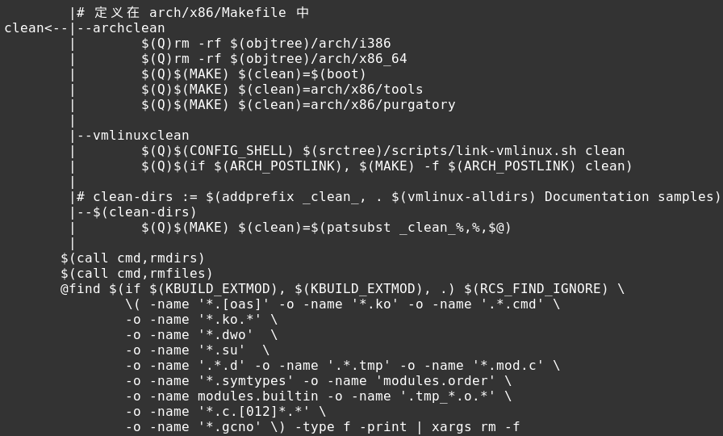

# Clean Infrastructure

clean 为什么可以称 Infrastructure？因为 Kbuild 系统的 clean 有三种层次的实现：

1. make clean:  Delete most generated files, Leave enough to build external modules
2. make mrproper: Delete the current configuration, and all generated files
3. make distclean: Remove editor backup files, patch leftover files and the like

clean, mrproper, distclean, 递进的进行 clean，所以称之为 infrastructure。相关的代码都定义在 top Makefile 中。但它们的定义在空间上跨越很大,不易厘清，用伪代码来展示一下：

	ifeq ($(KBUILD_EXTMOD),)
		ifdef CONFIG_MODULES
		else
		endif #CONFIG_MODULES

		clean: bluhbluh
		mrproper: bluhbluh
		distclean: bluhbluh

	else
	endif # KBUILD_EXTMOD

	clean: bluhbluh
	
clean 完成大多数的清理动作，mrproper, distclean 都是在 clean 基础上继续清理。

## clean

clean 的流程图：

可以看出很多清理动作都和变量 "clean" 有关，定义在 scripts/Kbuild.include：

	clean := -f $(srctree)/scripts/Makefile.clean obj

如果看懂了前面的两篇文章，会发现 Makefile.clean 的内容在结构上和其他 scripts/ 目录下的 Makefile 大同小异, 递归式的进入每一个子文件夹下清理，需要清理的内容都定义在 “__clean-files” 和 “__clean-dirs”(怀疑 clean-dirs 并没有用)。

Target "clean" 的 recipe：

	CLEAN_DIRS  += $(MODVERDIR)
	clean: rm-dirs  := $(CLEAN_DIRS)
	clean: rm-files := $(CLEAN_FILES)

	cmd_rmdirs = rm -rf $(rm-dirs)
	cmd_rmfiles = rm -f $(rm-files)

	$(call cmd,rmdirs)
	$(call cmd,rmfiles)

## mrproper

## distclean
参考 `5 Kbuild clean infrastructure` of Documentation/kbuild/makefiles.txt
### 本文完